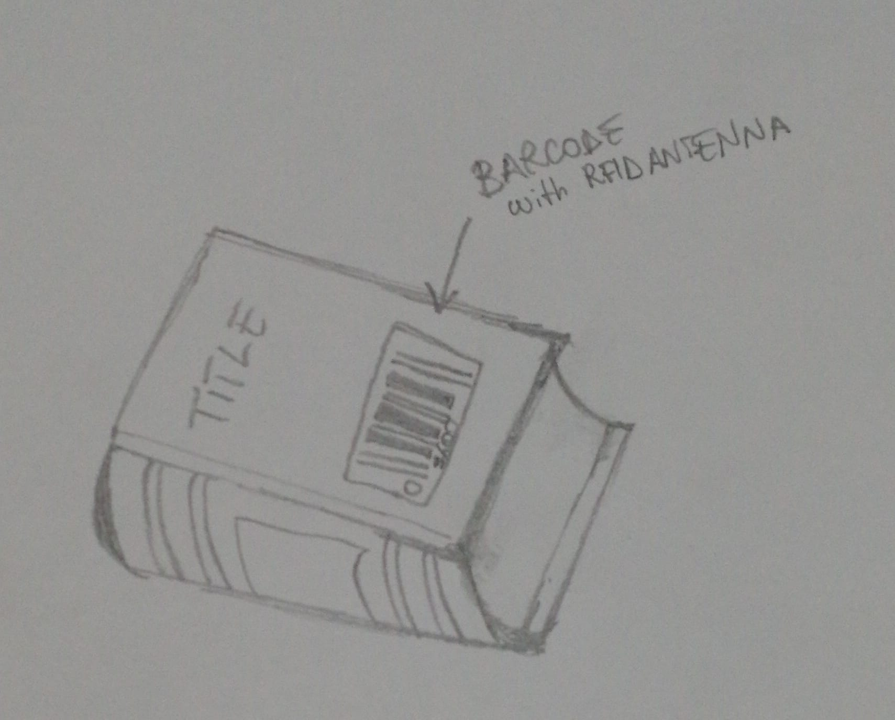
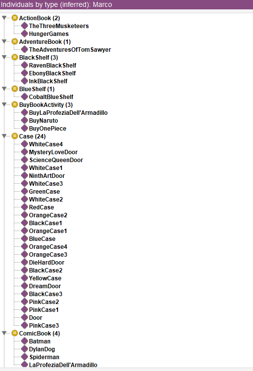
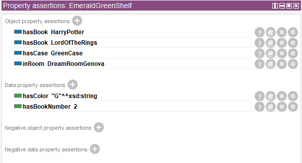
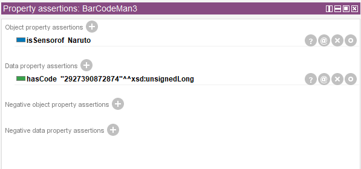

# AMBIENT INTELLIGENCE ASSIGNMENT

## REPOSITORY ORGANIZATION

In the repository you can find the Ontology as *AI-Read_Outlet_Ontology.Owl* file, the *README.md* and all the images used in such readme file.
To use the Ontology just open it with Protègè 5.5.0.

## THE IDEA

The name of my project is **AI-Read Outlet**.
The idea is to create a smart environment where people can buy books in a fast and pleasure way.
The problems are that in libraries we waste time in searching our favourite books, long queries for buying them and low surveillance. 
This project can solve this problems:
* Introducing a preference-based connection between rooms can reduce the books' hunt and browse directly your desired ones. This is done by a stereo camera that gathers person's image, elaborates data and send them to a computer that through an algorithm displays which room is in line with the costumer. The choice is done by selecting the icon on a screen near the door. Once selected the room, you are brung directly to the wished one. Obviously near the door there is a switch for open it.  
* To avoid long queries it is possible to buy a book simply reading the barcode on the cover, indeed in the barcode is implemented a RFID antenna which can be read by the client's phone.
* To prevent robberies, vandalisms and book's exchange on incorrect shelves, the stereo camera works also as a supervisor in combination with a PIR sensor that reacts to people who stole books. Cases are mounted on shelves that can be opened only by switching an interrupt near them.

## POSSIBLE STRUCTURE

In Fig. 1 it is illustrated a possible structure of the shop (the one described in the ontology).

 _Fig.1 Plant of the shop_

As it's shown, all the rooms are connected at the entrance and are initially close.
Books are divided in specific shelves associated with a specific color that indicates their category.
Rooms have names related to the categories, e.g. NinthArt room has origin from the classification of arts, comics are the ninth art in the world.
Thus, the client will start his journey in the shop entering in the entrance passing through a PIR sensor and catched by a stereo camera.
In this case the outlet owner can see if a person is entered or not, and the camera can process the data of the customer checked, send them to a
computer, compute the algorithm and suggest the preferred room to visit on the display near the door. Once near it, the person selects the place
and will open the door by switching the button on the side; in this way also the selected room's door is opened, drawing a path to the desired chamber.
In the room the customer can browse every book and buy how many he wants just by reading the barcode with his phone.
Hovewer, to take a book a built-in case needs to be open, and it's done by switching the interrupt on the side.
Fig.2 and Fig.3 are a zoom of how shelves and books are designed.

_Fig.2 A Shelf with case and a switch sensor_

_Fg.3 A Book with the barcode (RFID Antenna)_

## ONTOLOGY KNOWLEDGE REPRESENTATION

The ontology of the AI-Read Outlet project is made with Protègè and Pellet reasoner.
It is created according to the thumb rules of the assignment:
- At list 3 top Classes are required in the TBox 
- At list 4 Object Properties and 4 Data Properties should be created and used in the TBox
- At list 6 Individual Assertions and 6 Property Assertions should be added in the ABox
- Add at least one SWRL rule, to try how rules work.

### TBOX

#### CLASSES

*7 Top Classes* have been created, with their respective sub-classes:

- **Activity** This class represents the activities that a person can do in the shop, defined as overlapping some sensor (Activity = ∃overlap.Sensor)
  - **BuyBookActivity** is a sub class of activity and it is the activity done when a customer buy a book, so when his phone is reading the barcode (BuyBookActivity = Activity ⋂ ∃(overlap.RFIDAntennaSensor ⋂ overlap.Phone)
  - **EnteredActivity** is a sub class of activity and it is the activity representable as overlapping the PIR sensor or the stereo camera sensor (EnteredActivity = Activity ⋂ ∀(overlap.CameraSensor ⋂ overlap.PIRSensor)
  -  **OpenCaseActivity** is a sub class of activity done when switching the interrupt (OpenCaseActivity = Activity ⋂ ∀overlap.SwitchSensor)

- **Book** This class represents the books on sales, they are defined as something on a shelf with a barcode associated and a number of pages (Book = ∃isBookof.Shelf ⋂ ∃hasPage.int ⋂ ∀hasSensor.RFIDAntennaSensor)
  - **ActionBook** Books of action type placed on the RedShelf class (ActionBook = Book ⋂ ∀isBookof.RedShelf ...)
  - **AdventureBook** Books of adventure type placed on the BlueShelf class (AdventureBook = Book ⋂ ∀isBookof.BlueShelf ...)
  - **ComicBook** Comics placed on the OrangeShelf class (ComicBook = Book ⋂ ∀isBookof.OrangeShelf ...)
  - **FantasyBook** Books of fantasy type placed on the GreenShelf class (FantasyBook= Book ⋂ ∀isBookof.GreenShelf ...)
  - **LoveStoryBook** Books of romantic type placed on the PinkShelf class (LoveStoryBook= Book ⋂ ∀isBookof.PinkShelf ...)
  - **MangaBook** Manga comics placed on the WhiteShelf class (MangaBook= Book ⋂ ∀isBookof.WhiteShelf ...)
  - **NoirBook** Books of noir type placed on the BlackShelf class (NoirBook= Book ⋂ ∀isBookof.BlackShelf ...)
  - **PhilosophicBook** Books of philosophic type placed on the YellowShelf class (FantasyBook= Book ⋂ ∀isBookof.YellowShelf ...)
  
- **Case** This class represents the case that covers the shelves, but also the doors, interpreted as a case that covers a wall. Moreover has a switch sensor to open it (Case =  ∀hasSensor.SwitchSensor ⋂ ∃isCaseof.Shelf ⋃ ∃isCaseof.Room)

- **Person** This class represents the customers of the shop, that have done some activities and have a phone to read a barcode; the phone here is a sub-class of a camera sensor. In addition it counts how many books they buy. (Person = ∃hasDone.Activity ⋂ ∃hasPhone.Phone ⋂ ∃hasBoughtBook.integer)

- **Room** This class represents all the rooms in the shop, a room is connected to another room, has a specific number of shelves and a case. (Room = (∃hasShelf.Shelf ⋃ ∃hasCase.Case) ⋂ ∃isConnected.Room ⋂ ∃hasShelfNumber.int
  - **DieHardRoom** Room that contains red shelves and blue ones, in a range of 2-5; the name stands for the type of books on the shelves: the action and adventure ones.It is connected to the Entrance room.
  - **DreamRoom** Room that contains green shelves, in this case has value 1; here fantasy books are listed so the name means place where you can dream. It is connected to the Entrance room.
  - **EntranceRoom** Principal room that has no shelves and contains the PIR, stereo camera and switch sensors. It is connected to all rooms and has a case (the door) to open if you want to buy a book.
  - **MysteryLoveRoom** Room that contains pink shelves and black ones, in a range of 6-7; the name stands for the type of books on the shelves: the romantic and noir ones.It is connected to the Entrance room.
  - **NinthArtRoom** Room that contains white shelves and orange ones, in a range of 8-9; the name cames from a classification that people give to arts: comics are the ninth one. It is connected to the Entrance room.
  - **ScienceQueenRoom** Room that contains yellow shelves, in this case has value 1; the name cames from the definition of philosophy: the queen of all sciences. It is connected to the Entrance room.
  
- **Sensor** This class represents the sensors involved in the outlet, is a primitive class without specific definition, only sub-classes are defined
  - **CameraSensor** Camera sensor class that includes the stereo camera in the Entrance and phone here considered as a sensor (CameraSensor = Sensor ⋂ ∀isSensorof.Room)
    - **Phone** is a sub-class of camera sensor that a person has (Phone = CameraSensor ⋂ ∀isPhoneof.Person)
    - **StereoCameraSensor** sub-class of camera sensor staes in the Entrance (StereoCameraSensor = CameraSensor ⋂ ∀isSensorof.EntranceRoom)
  - **PIRSensor** PIR sensor positioned on the entrance of the shoop to determine if someone is entered or not (PIRSensor = Sensor ⋂ ∀isSensorof.EntranceRoom)
  - **RFIDAntennaSensor** RFID implemented in books, so every sensor of this type has a code associated (RFIDAntennaSensor = Sensor ⋂ ∀isSensorof.Book ⋂ ∃hasCode.unsignedLong)
  - **SwitchSensor** Switch sensor near cases (SwitchSensor = Sensor ⋂ ∀isSensorof.Case)

- **Shelf** This class represents the shelves that contains books and are in rooms. At every category of book is associated a colored shelf and this is how we can classify them. Every shelf has a case and also counts the number of books in. (Shelf = ∃hasBook.Book ⋂ ∃hasCase.Case ⋂ ∃inRoom.Room ⋂ ∃hasBookNumber.(>=1) ⋂ ∃hasColor.string)
  - **BlackShelf** contains noir books and has black colors, it is placed in the MysteryLove room (BlackShelf = Shelf ⋂ ∃hasColor."Black" ⋂ ∃hasBook.NoirBook ⋂ ∀inRoom.MysteryLoveRoom ...)
  - **BlueShelf** contains adventure books and has blue colors, it is placed in the DieHard room (BlueShelf = Shelf ⋂ ∃hasColor."Blue" ⋂ ∃hasBook.AdventureBook ⋂ ∀inRoom.DieHardRoom ...)
  - **GreenShelf** contains fantasy books and has green colors, it is placed in the Dream room (GreenShelf = Shelf ⋂ ∃hasColor."G" ⋂ ∃hasBook.FantasyBook ⋂ ∀inRoom.DreamRoom ...)
  - **OrangeShelf** contains comic books and has orange colors, it is placed in the NinthArt room (OrangeShelf = Shelf ⋂ ∃hasColor."O" ⋂ ∃hasBook.ComicBook ⋂ ∀inRoom.NinthArtRoom ...) 
  - **PinkShelf** contains lovestory books and has pink colors, it is placed in the MysteryLove room (PinkShelf = Shelf ⋂ ∃hasColor."P" ⋂ ∃hasBook.LoveStoryBook ⋂ ∀inRoom.MysteryLoveRoom ...)
  - **RedShelf** contains action books and has red colors, it is placed in the DieHard room (RedShelf = Shelf ⋂ ∃hasColor."R" ⋂ ∃hasBook.NoirBook ⋂ ∀inRoom.DieHardRoom ...)
  - **WhiteShelf** contains manga booka and has white colors, it is placed in the NinthArt room (WhiteShelf = Shelf ⋂ ∃hasColor."W" ⋂ ∃hasBook.MangaBook ⋂ ∀inRoom.NinthArtRoom ...)
  - **YellowShelf** contains philosophic books and has yellow colors, it is placed in the ScienceQueen room (YellowShelf = Shelf ⋂ ∃hasColor."Y" ⋂ ∃hasBook.PhilosophicBook ⋂ ∀inRoom.ScienceQueenRoom)

All classes are disjoint except for the sub-classes of room, because some shelves share the same room or some sensor are in the same room and this will cause inconsistency.

#### OBJECT PROPERTIES

*13 Object Properties* have been created:

- **hasBook** relation between a shelf that has books in. (Domains = Shelf; Range = Book; Inverse of isBookof)

- **hasCase** relation between a room or a shelf that has a case (Range = Case; Inverse of isCaseof). The absence of domain is due to the fact that we wants the union of Room class and Shelf one, but in protègè we can only have a intersection.

- **hasDone** relation between a person that has done some activities in the shop (Domain = Person; Range = Activity)

- **hasPhone** relation between a person that has a phone (Domain = Person; Range = Sensor; Inverse of isPhoneof)

- **hasSensor** relation between a case or a room that has sensors inside/aside (Range = Sensor; Inverse of isSensorof). Also here the domain is not considered.

- **hasShelf** relation between a room where are placed shelves (Domain = Shelf; Range = Room; Inverse of inRoom)

- **inRoom** Inverse of hasShelf so range and domain are inverted

- **isBookof** Inverse of hasBook so range and domain are inverted

- **isCaseof** Inverse of hasCase so range and domain are inverted

- **isConnected** relation between room connected with another room (Domain = Room; Range= Room). It is avoided the reflective property because cause unexpected inconsistency in the ontology.

- **isPhoneof** Inverse of hasPhone so range and domain are inverted

- **isSensorof** Inverse of hasSensor so range and domain are inverted

- **overlap** relation between an Activity class and a sensor (Domain = Activity; Range = Sensor)

Object properties are built in order to have a sense and to respect the thumb rules.

#### DATA PROPERTIES

*7 Data Properties* have been created:

- **hasBookNumber** number of books on a shelf (Domain = Shelf; Range = xsd:integer)

- **hasBoughtBook** number of books bought buy a person (Domain = Person; Range = xsd:integer)

- **hasCode** barcode of 13 digits (random generated) on a book (Domain = RFIDAntennaSensor; Range = xsd:unsignedLong)

- **hasColor** color of a shelf (Domain = Shelf; Range = xsd:string)

- **hasDiscount** discount of 20% if a person buy more than 2 books, data property created only for the SWRL rule (maybe a day on the inauguration we can apply a real discount) (Domain = Person; Range = xsd:decimal)

- **hasPage** number of pages of a book (Domain = Book; Range = xsd:int)

- **hasShelfNumber** number of shelves in a room (Domain = Room; Range = xsd:int)

Data properties are built in order to enhance the ontology and add more enclosure to the definitions of class.

### ABOX

#### SCENARIO

Assertions are created according to a possible realistic scenario where 2 person Giulia and Marco entered the shop and only Marco makes some purcheses: he buys Naruto, One Piece and La Profezia dell'Armadillo. The AI-Read Outlet is located in Genova, the Entrance has a simple pirsensor and a StereoLabsZED as a stereo camera. All switches and cases are colored according to the shelves' color. The number of shelves in a room and their color can be seen in the Fig.1 of the *POSSIBLE STRUCTURE* paragraph.

#### INDIVIDUAL ASSERTION

*111 Individuals* have been created
In the Fig.4 it is illustrated a screen of some indivduals of the ontology.

 _Fig.4 Individuals assertions_

In the **AI-Read_Outlet_Ontology.Owl** file you can see all the individuals.

#### PROPERTY ASSERTION

*329 Property Assertion* have been created
In the Fig.5 and Fig.6 it is illustrated a screen of some property assertions of the ontology.

 _Fig.5 Property assertions of the individual EmeraldShelf_

 _Fig.6 Property assertions of the individual BarCodeMan3_

In the **AI-Read_Outlet_Ontology.Owl** file you can see all the property assertions.

### SWRL RULE

To avoid an huge enhancement of the ontology it is implemented one SWRL rule in the ontology. Considering a realistic scenario, it is possible to has a discount of 20% on books, if a person can buy more than two. Then the rule is: *Person(?p) ^ hasBoughtBook(?p, ?nb) ^ swrlb:greaterThan(?nb, 2) -> hasDiscount(?p, 0.2)*

## CONCLUSION AND IMPROVEMENTS

This ontology is created in order to satisfy the requiremnts of an assignment.
Nevertheless, for a future in which smart environments can be build in the real world, improvements can be done to enrich this ontology.
For example the addition of a class *Author* in order to give another classification of book.
Design the correct number of objects and rooms according to the seller's availability and preferences (e.g. more rooms, different colors, ...).
I hope this can be a start point for a future in which love for reading never dies.

 

